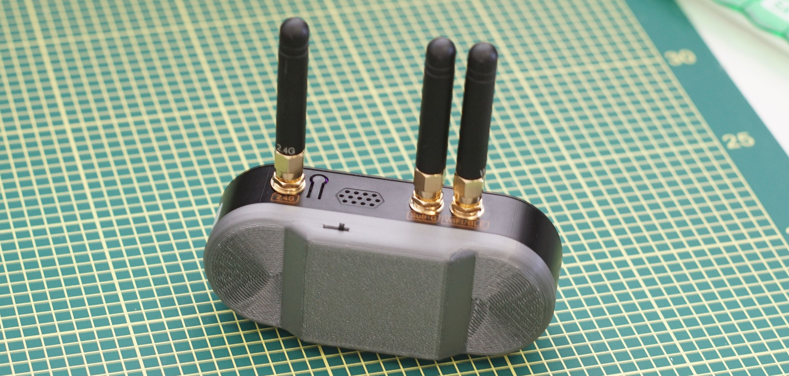
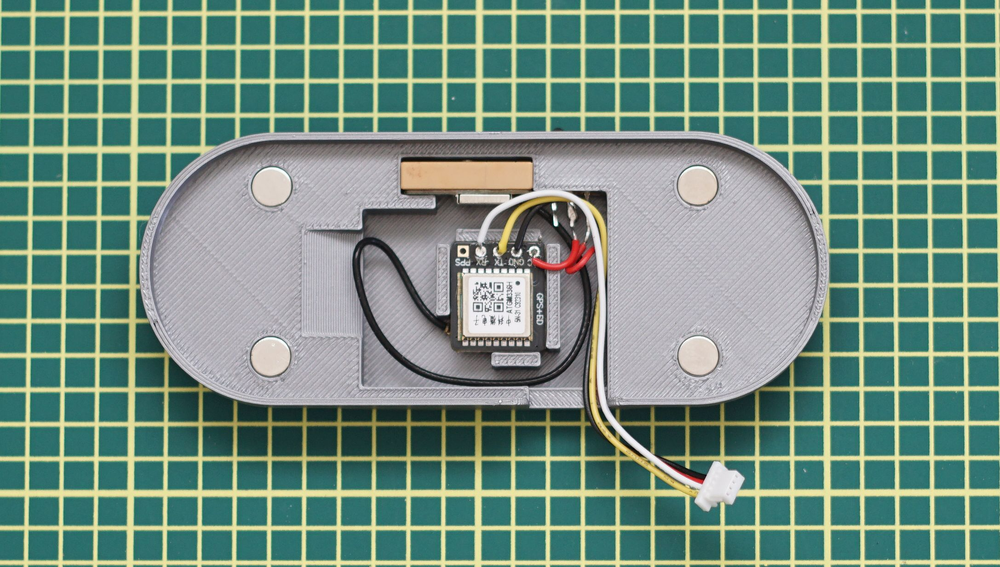

# LILYGO T-Embed-CC1101 Plus GPS Add-on

## Bill of materials

| Item                                | vendor    | vendor part no. | Price  | Notes                                                                                   |
| ----------------------------------- | --------- | --------------- | ------ | --------------------------------------------------------------------------------------- |
| ATGM336H GPS+BDS Dual-Mode-Modul    | amazon.de | B0FKH26344      | 10,99€ |                                                                                         |
| Schiebeschalter Mini Satz           | amazon.de | B0FG2TSLFC      | 9,59€  | Exact switch used in the project is **SS12D00G/6MM**                                    |
| 20Pcs Mini Micro Jst 1.0mm Sh 4-Pin | amazon.de | B0834WGQWQ      | 8,90€  |                                                                                         |
| Magnete Stark, 6x2mm                | amazon.de | B0DRNQT85B      | 12,99€ | magnets I used, the FreeCAD proejct can be altered If a different size magnet is needed |

## Changing model parameters and printing

### Model parameters

1. Different size magnets:
	1. Edit **Sketch001** and change the size of all four Circles to the desired diameter (I add 0.1 mm to make assembly easier)
2. Different size power Switch
	1. Edit parameters of the Rectangle in **Sketch010**
	2. You can also edit **Power Switch Pocket005** and **-006** to change the depth, to accommodate a different lever length on the switch

### Printing
These are just my suggestions for a quick and strong print:
- Print in PETG
- Auto orient the model
- Enable normal snug supports
- Use 25% Gyroid, or 3D Honeycomb infill

## Assembly

1. Trim down the JST 4-Pin cable to 60-70 mm length (2.25 inches - 2.75 inches).
	1. I trimmed my cable to 65 mm (2.5 inches), which leaves a bit of slack to be able to disconnect the GPS module without removing the add-on
2. (optional) Cut an extra length of ~ 10 mm of cable (half inch) of red wire for the power switch.
3. (optional) Solder the red wire on the JST cable and the extra piece of red wire to the power switch.
4. Solder the wires the following way:
	1. **Red** goes to **VCC** on the GPS module.
	2. **Black** goes to **GND** on the GPS module.
	3. **Yellow** goes to **TX** on the GPS module.
	4. **White** goes to **RX** on the GPS module.
5. Carefully connect the GPS antenna to the GPS module.
6. Prepare the 3D-printed part by putting the magnets into the case
	1. **Be careful to slot the magnets into the case with the correct polarity!**
	2. If you are using my bill of materials exactly, the magnets will take a bit of force to  slot into the case.
7. Start the final assembly by carefully putting the power switch into place first.
8. Continue by putting the antenna and module in their place.
9. (optional) secure the antenna and JST cable with a small piece of electrical tape.